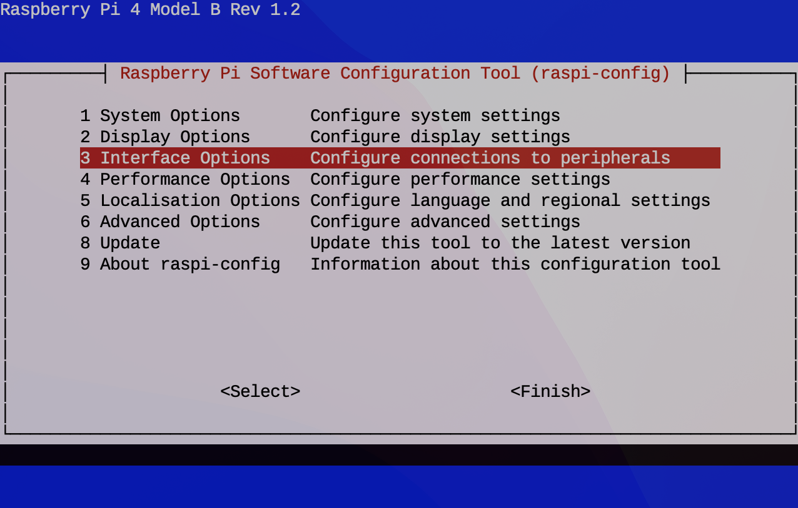
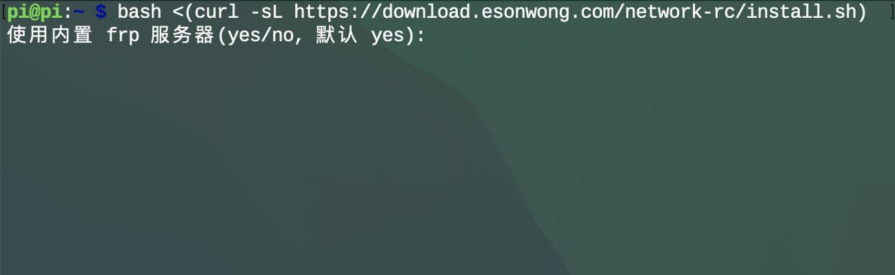
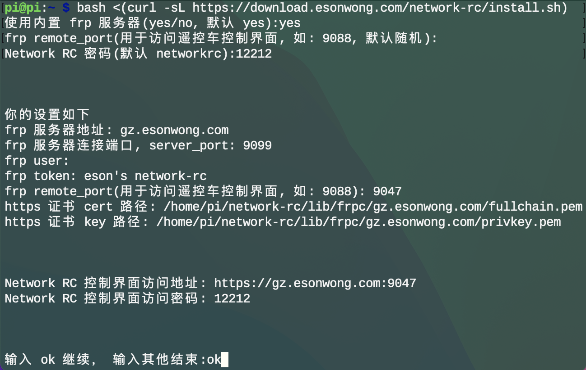

# 制作教程

## 树莓派上安装 Network RC

### 安装树莓派操作系统

根据这篇教程的“方法二”安装树莓派系统，并启用 SSH， 连接到 WiFi。

[树莓派4B【RaspBerry Pi 4 Model B】系统安装及配置教程](http://article.docway.net/it/details/606bfa970a6c642cafe259fc)

### 打开摄像头

系统安装完成后使用 SSH 连接到树莓派命令行终端。如果连接显示器，则打开命令行终端。

1. 输入命令:

   ```bash
   sudo raspi-config
   ```

   

2. 选择 `Interface Options` 回车
3. 选择 `P1 Camera` 回车
4. 选择 `Yes`/`是`/`OK` 回车
5. 关闭树莓派电源
6. 连接树莓派 CSI 摄像头
7. 打开树莓派电源

### 安装 Network RC

使用一键安装脚本安装 Network RC 软件:

1. 在终端输入 Network RC 安装命令，回车执行：

   ```bash
   bash <(curl -sL https://download.esonwong.com/network-rc/install.sh)
   ```

   

2. 输入`yes`并回车，使用默认设置来安装
3. 回车，使用随机访问端口
4. 设置登录密码，回车确认

   

5. 记录你的**控制界面登陆地址**和**密码**
6. 输入`ok`并回车开始下载和安装 Network RC

安装完成后通过其他设备的浏览器即可打开控制界面登陆地址, 使用密码登录。

## 连接树莓派和舵机

### 电调

> 大部电调会在开机时对中位信号进行校准，请确保电调电源打开前 10 秒不要操作。

### 舵机

### 云台

## 其他

### 供电保障

### 网络连接
